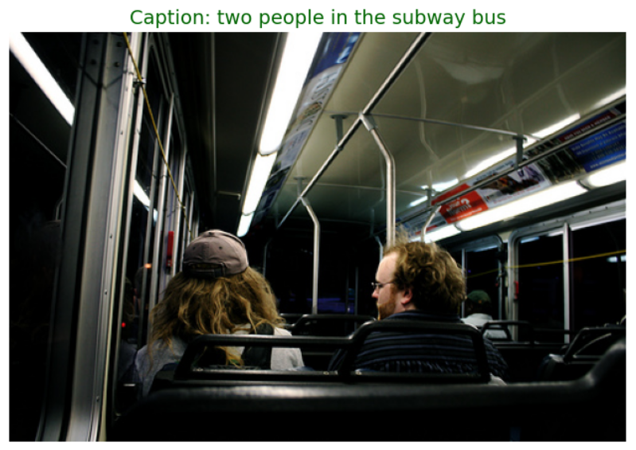

# Sinh Mô Tả Ảnh (Image Captioning) Sử Dụng Attention

## 1. Giới thiệu

Dự án này xây dựng mô hình học sâu có khả năng tự động sinh mô tả (caption)
cho hình ảnh dựa trên kiến trúc Encoder–Decoder kết hợp cơ chế Attention.

Bài toán Image Captioning là sự kết hợp giữa:
- Thị giác máy tính (Computer Vision)
- Xử lý ngôn ngữ tự nhiên (NLP)

## Bộ dữ liệu

Dự án này sử dụng bộ dữ liệu **Flickr8k** cho bài toán Image Captioning.
Flickr8k là một bộ dữ liệu chuẩn (benchmark dataset) thường được sử dụng trong nghiên cứu và thực nghiệm các mô hình Image Captioning.

- Nguồn: Flickr8k trên Kaggle
- Tổng số ảnh: 8.000 ảnh
- Mỗi ảnh có 5 câu mô tả do con người gán nhãn.

Do giới hạn dung lượng của GitHub, thư mục ảnh gốc (`data/Images/`) không được đưa vào repository này.

Bạn có thể tải bộ dữ liệu tại:
https://www.kaggle.com/datasets/adityajn105/flickr8k

Sau khi tải về, đặt dữ liệu theo cấu trúc:

Image_captioning/
│
├── data/
│   ├── Images/
│   └── captions.txt
---

## 2. Mục tiêu

- Trích xuất đặc trưng ảnh bằng mạng CNN (Encoder)
- Sinh câu mô tả bằng LSTM (Decoder)
- Áp dụng Attention để cải thiện chất lượng mô tả
- Đánh giá mô hình trên tập kiểm tra

---

## 3. Kiến trúc mô hình

Mô hình gồm 3 thành phần chính:

### 🔹 Encoder
- Sử dụng CNN để trích xuất đặc trưng ảnh
- Loại bỏ lớp phân loại cuối cùng
- Xuất ra vector đặc trưng mức cao

### 🔹 Decoder
- Sử dụng LSTM để sinh từng từ của câu
- Dựa vào đặc trưng ảnh và từ trước đó

### 🔹 Attention
- Cho phép mô hình tập trung vào vùng ảnh quan trọng
- Cải thiện khả năng sinh mô tả chính xác

---

## 4. Quy trình thực hiện

### Bước 1: Tiền xử lý dữ liệu
- Làm sạch và chuẩn hóa caption
- Thêm token `<start>`, `<end>`, `<unk>`, `<pad>`
- Xây dựng từ điển `word2idx` và `idx2word`
- Resize và chuẩn hóa ảnh

### Bước 2: Trích xuất đặc trưng
- Đưa ảnh qua CNN
- Lưu đặc trưng vào file `features_attention.pkl`
## File đặc trưng ảnh (Image Features)

Để tăng tốc quá trình huấn luyện, đặc trưng ảnh được trích xuất trước bằng mô hình CNN (InceptionV3) và lưu lại dưới dạng file:

data/features_attention.pkl

File này chứa vector đặc trưng của toàn bộ ảnh trong dataset.

Do kích thước lớn (khoảng 4GB), file này không được upload lên GitHub.

Bạn có thể:
- Tự chạy notebook để trích xuất lại đặc trưng

### Bước 3: Huấn luyện mô hình
- Tính loss bằng CrossEntropyLoss
- Tối ưu bằng Adam
- Huấn luyện theo từng epoch

### Bước 4: Đánh giá
- Sinh caption cho ảnh trong tập test
- So sánh với caption thực tế
- Tính BLEU score (nếu có)

---

## 5. Cấu trúc thư mục
```
Image_captioning/
│
├── data/                     
│   ├── Images/                           # thư mục chứa ảnh
│   ├── features_attention.pkl            # Đặc trưng ảnh đã trích xuất                                     
│   └── captions.txt                      # File chứa captions ảnh 
├── Project2_attention.ipynb              # Notebook chính
├── Pic/                                  # Hình ảnh minh họa
└── README.md
```
---

## 6. Công nghệ sử dụng

- Python
- PyTorch
- NumPy
- Matplotlib
- Pandas

---

## 7. Kết quả

Mô hình có khả năng sinh mô tả phù hợp với nội dung hình ảnh.
Chất lượng phụ thuộc vào:
- Kích thước dữ liệu
- Kiến trúc Encoder
- Cơ chế Attention

Ví dụ kết quả:

Ảnh: 
<p align="center">
  
</p>
<p align="center">
  <em>Hình 1: Kết quả sinh caption cho ảnh mẫu</em>
</p>
Caption dự đoán: "two people in the subway bus"

---

## 8. Hướng phát triển

- Sử dụng CNN pretrained mạnh hơn (ResNet)
- Fine-tune Encoder
- Tăng kích thước dữ liệu
- Áp dụng Beam Search khi sinh câu

---

## 9. Tác giả

Họ và tên: Nguyễn Minh Quân  
Lĩnh vực quan tâm: Computer Vision, Deep Learning
